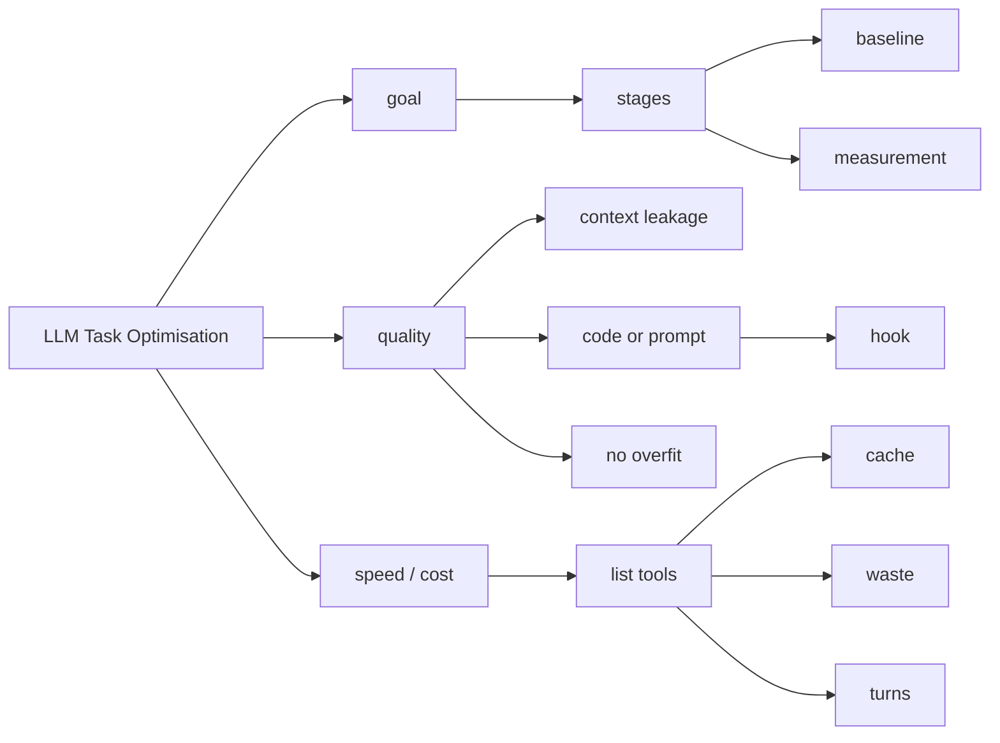
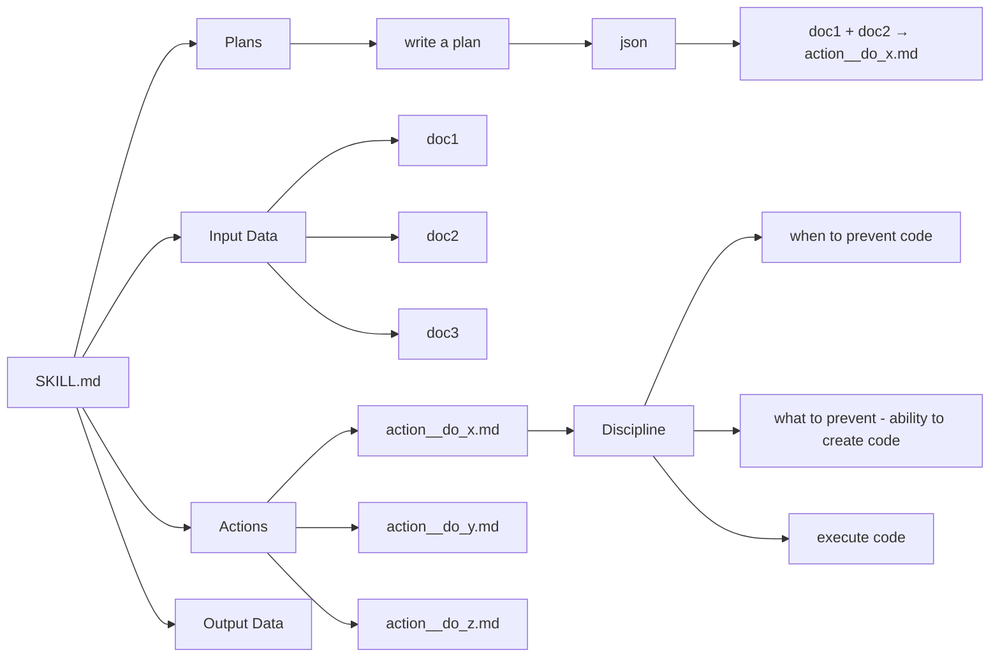

# Tooling to Shape Projects

This provids tooling to help shape projects into optimal structure

## 1. LLM Task Optimisation

```mermaid
flowchart LR
    A[LLM Task Optimisation]
    A --> B[goal]
    A --> C[quality]
    A --> D[speed / cost]
    B --> B1[stages]
    B1 --> B1a[baseline]
    B1 --> B1b[measurement]
    C --> C1[context leakage]
    C --> C2[code or prompt]
    C --> C3[no overfit]
    C2 --> C2a[hook]
    D --> D1[list tools]
    D1 --> D1a[cache]
    D1 --> D1b[waste]
    D1 --> D1c[turns]
```

---

## 2. SKILL.md Structure

```mermaid
flowchart LR
    SKILL[SKILL.md]
    SKILL --> Plans[Plans]
    Plans --> Write[write a plan]
    Write --> JSON[json]
    JSON --> Compose[doc1 + doc2 → action__do_x.md]

SKILL --> InputData[Input Data]
InputData --> Doc1[doc1]
InputData --> Doc2[doc2]
InputData --> Doc3[doc3]

SKILL --> Actions[Actions]
Actions --> ActionX[action__do_x.md]
Actions --> ActionY[action__do_y.md]
Actions --> ActionZ[action__do_z.md]

ActionX --> Discipline[Discipline]
Discipline --> Stop[when to prevent code]
Discipline --> Create[what to prevent - ability to create code]
Discipline --> Execute[execute code]

SKILL --> OutputData[Output Data]
```
