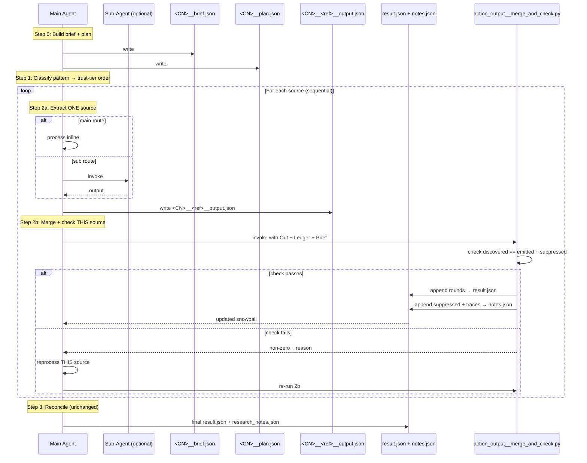

# v032 — Fix: per-source handshake/merge (sub-agent → ledger)

## The defect

Baseline already has the right architecture: **sequential snowball ledger**. Each source's input is the accumulated `result.json` + `notes.json` from all previous sources.

**The failure:** per-source append is done by the main agent **by hand**, and the hand-merge silently dropped whole sources (Crisp's 1D, Darktrace's 1D+1A).

**Wrong path (reverted):** batch merge at the end. This breaks the ledger — source 2 runs against empty ledger, source 3 can't see 1 or 2. The fix must be **per source, inside the loop.**

## The fix

Replace the **per-step hand-append** with a deterministic Python merge, called **every iteration**, right after the source produces output and before the loop advances.

## Corrected flow

## The new function: `scripts/action_output__merge_and_check.py`

| Aspect      | Detail                                                                                                    |
|-------------|-----------------------------------------------------------------------------------------------------------|
| Called by   | Main agent, once per source, at step 2b                                                                   |
| Inputs      | `<CN>__<ref>__output.json`, `result.json`, `notes.json`, `<CN>__brief.json`, `CN`, `ref`                  |
| Check       | `discovered == emitted + suppressed` — `discovered` = brief census count                                  |
| Merge       | `rounds` → `result.json`; `suppressed_records` + `per_round_traces` + `cross_source_flags` → `notes.json` |
| Output      | Updated `result.json` + `notes.json` on success; non-zero + reason on failure                             |
| Idempotency | Guard: refuse to merge a `ref` that already has a `coverage` row                                          |

## Supporting changes

1. **`main` sources now write per-source output file too** — same shape as `sub`
2. **Rename** `<CN>__<ref>__subagent.json` → `<CN>__<ref>__output.json`
3. **`SKILL.md` step 2** — replace hand-append with `action_output__merge_and_check.py`
4. **`instruction.md`** — mirror step 2 change

## Out of scope

- Step 3 (Reconcile) — unchanged
- Structural leak (`instruction.md` duplicating SOP) — separate cleanup

## Acceptance

- [ ] Source's rounds appear in `result.json` immediately after processing (visible to next source)
- [ ] Crisp: 1D equity rounds survive
- [ ] Darktrace: 1D (IPO) + 1A (charges) + acquisition all land
- [ ] Short source fails check and is reprocessed before loop advances
- [ ] No batch/end-of-run merge — `action_output__merge_and_check.py` invoked once per source, inside loop
